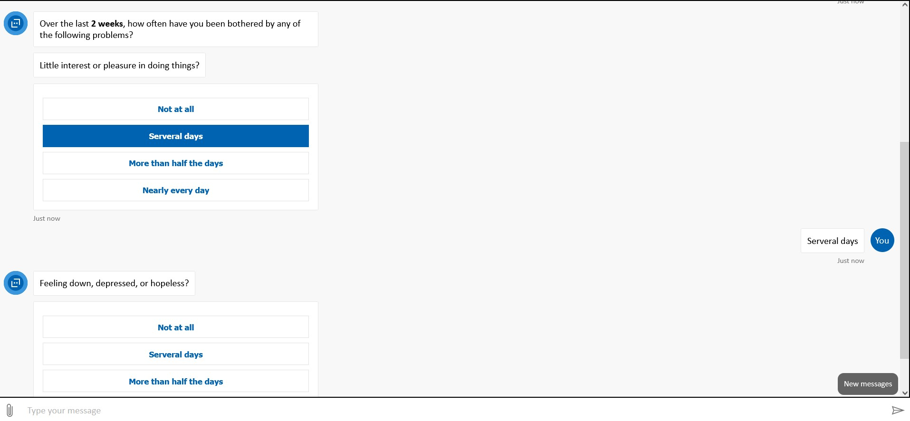

# Menti-Buddy
Mental Health bot that can predict the severity of depression based on questions answered by users.

Aside from prediction of depression it can also help in

- Getting information about an illness
- Based on complication and symptoms predict the type of illness
- Symptom checker
- Assess the severity of depression

## To start the mental health screener start by typing "I need mental help"

Project can be found - [Here](https://mentalhealthcare-bot-jh57f2nphpeii.azurewebsites.net)👈

Screenshots of Project - 

### Edit: This project was part of Future Ready Talent Program but now will be built independently to add more features.
### Currently looking for collaborators for this project
